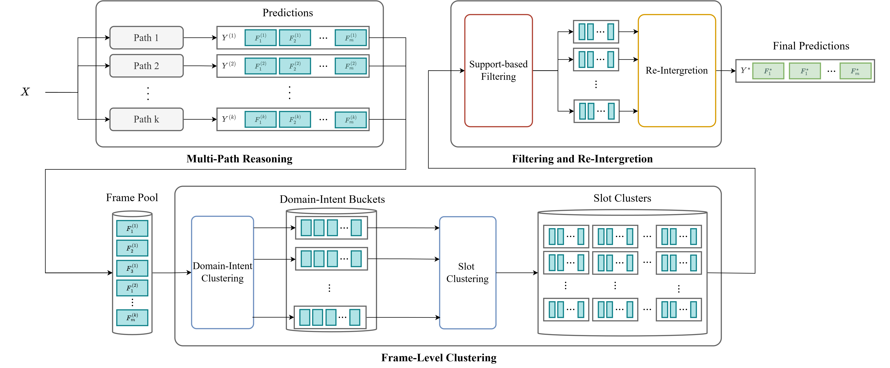

# SFL-MTSC: Leveraging Semantic Frame-Level Multi-Task Self-Consistency for Robust Multi-Intent Spoken Language Understanding

<div align="center">
      <h2>Authors</h2>
      <p>
        <strong>Po-Yen Chen</strong><sup>1</sup>,  
        <strong>Berlin Chen</strong><sup>1</sup>,  
      </p>
</div>

<div align="center">
    <p>
        <sup>1</sup> National Taiwan Normal University, Taiwan
    </p>
</div>

<div align="center">
<p>
      <sup>1</sup> <a href="mailto:cby931001@gmail.com">cby931001@gmail.com</a> 
      <sup>2</sup> <a href="mailto:berlin@ntnu.edu.tw">berlin@ntnu.edu.tw</a>,  
</p>
</div>

<div align="center">

<strong style="font-size: 18px;">Accepted by Interspeech 2026</strong> <br>
</div>

This repository contains the code and resources for **SFL-MTSC**, a framework introduced in our paper "SFL-MTSC: Leveraging Semantic Frame-Level Multi-Task Self-Consistency for Robust Multi-Intent Spoken Language Understanding". 

We offer the benchmark to evaluate our framework for three metrics: **intent accuracy**, **slot F1 score** and **overall accuracy**.

## ⭐ Overview
SFL-MTSC is a post-inference aggregation framework for robust multi-intent spoken language understanding (SLU).SFL-MTSC is a post-inference aggregation framework for robust multi-intent spoken language understanding (SLU). It addresses decoding inconsistency in prompt-based LLM inference by operating at the semantic frame level: given an input utterance, it samples K reasoning paths at different temperatures, clusters the resulting frames via domain-intent grouping and Hybrid Jaccard slot similarity, filters unreliable clusters by path support, and re-integrates the survivors using a Value-First strategy to produce the final multi-intent prediction.

<p align="center">


## 🧱 Project Structure  
```
SFL-MTSC/
├── self-consistency.py   # SFL-MTSC mechanism script
├── slu.py                # SLU processing script
├── asr.py                # ASR script, use to process ASR model
├── metrics.py            # Evaluation metric
├── prompt.py             # prompt we use in inference
├── requirements.txt
├── .gitignore
└── README.md
```

## 🚀 Getting Started
### Dataset
In all of experiments, we use MAC-SLU dataset as our The complete MAC-SLU dataset is hosted on the Hugging Face Hub.

 * **Dataset Link:** [Gatsby1984/MAC\_SLU](https://huggingface.co/datasets/Gatsby1984/MAC_SLU)
  

### Environment Setup
#### vLLM and vLLM-Omni 
Our code relies on `vLLM` for model inference. All experiments are conducted with **Python 3.12**. Please refer to the [vLLM documentation](https://docs.vllm.ai/en/latest/getting_started/installation/) for installation instructions compatible with your hardware and target model.

Additionally, for **Qwen2.5-Omni**. You need to install `vLLM-Omni` after you installed `vLLM`. Please refer to the [vLLM-Omni documentation](https://docs.vllm.ai/projects/vllm-omni/en/latest/getting_started/quickstart/) for installation instructions.

#### Code Execute Environments
You need to install the dependencies before runing code. Please install dependencies need.

```sh
python3.12 -m venv .venv
source .venv/bin/activate
pip install -r requirements.txt
```

## 🛠️ Usage

### NLU Inference
#### Step 1: Deploy the Model with vLLM

Open a terminal and run the following command to start the vLLM server. This example is for `Qwen3-4B-Instruct-2507`

```sh
vllm serve "/path/to/your/Qwen3-4B-Instruct-2507" \
  --served-model-name Qwen3-4B-Instruct-2507  \
  --gpu-memory-utilization 0.9 \
  --host 0.0.0.0 \
  --port 12355 \
  --disable-log-requests \
  --uvicorn-log-level warning \
  --max-model-len 8192 \
  --enforce-eager \
```

#### Step 2: Run Inference

Once the server is running , open a new terminal and execute the inference script.

```sh
python slu.py \
    --input-file /path/to/test_set.jsonl \
    --output-file /path/to/prediction.jsonl \
    --model-name Qwen3-4B-Instruct-2507 \
    --api-base http://0.0.0.0:12355/v1 \
    --temperature 0 \
    --prompt-mode "vanilla"
```
- **Note**: For other models, you may need to change `--model-name` and the model path  in the `vllm serve` command. If you using cloud computing platform likes Runpod, you need to fill endpoint URL in `--api-base` to connect your GPU.

#### Step 3: Evaluation
```
python metrics.py prediction.jsonl gt.jsonl
```

## ASR
#### Step 1: Deploy the ASR Model with vLLM

Open a terminal and run the following command to start the vLLM server. This example is for `Whisper-Large-v3`

```sh
vllm serve "/path/to/your/whisper-large-v3" \
  --served-model-name Whisper-Large-v3  \
  --gpu-memory-utilization 0.85 \
  --host 0.0.0.0 \
  --port 12355 \
  --disable-log-requests \
  --uvicorn-log-level warning \
  --max-model-len 2048 \
  --enforce-eager \
```

#### Step 2: Running ASR and Get Script
Once the server is running , open a new terminal and execute the ASR script.
```sh
python asr.py \
    --input-file /path/to/your/test.jsonl \
    --audio-dir /path/to/audio_test_directory \
    --output-file /path/to/asr_result.jsonl \
    --model-name Whisper-Large-v3
```
- **Note**: For other models, you may need to change `--model-name` and the model path  in the `vllm serve` command. If you using cloud computing platform likes Runpod, you need to fill endpoint URL in `--api-base` to connect your GPU.


#### Following Steps
When you get your `asr_result.jsonl`, you can use it as `/path/to/test_set.jsonl` to execute slu.py likes NLU session.

## E2E model
#### Step 1: Deploy the Model with vLLM
Open a terminal and run the following command to start the vLLM server. This example is for `Qwen2.5-Omni-7B`

```sh
vllm serve "/path/to/your/Qwen2.5-Omni-7B" \
  --omni \
  --served-model-name Qwen2.5-Omni-7B \
  --gpu-memory-utilization 0.85 \
  --host 0.0.0.0 \
  --port 12355 \
  --disable-log-requests \
  --uvicorn-log-level warning \
  --enforce-eager \
```
- **Note**: Before you use **Qwen2.5-Omni**, you need to install `vLLM-omni`.

#### Step 2: Run Inference

Once the server is running , open a new terminal and execute the inference script.

```sh
python slu.py \
    --input-file /path/to/test_set.jsonl \
    --audio-dir /path/to/audio_test_directory \
    --output-file /path/to/prediction.jsonl \
    --model-name Qwen2.5-Omni-7B \
    --api-base http://0.0.0.0:12355/v1 \
    --temperature 0 \
    --prompt-mode "vanilla"
```
- **Note**: For other models, you may need to change `--model-name` and the model path  in the `vllm serve` command. If you using cloud computing platform likes Runpod, you need to fill endpoint URL in `--api-base` to connect your GPU.

#### Step 3: Evaluation
```
python metrics.py prediction.jsonl gt.jsonl
```


## SFL-MTSC
#### Step 1: SFL-MTSC
When you have some results of inference. You can put your origin predictions in a directory. Then, you can execute the SFL-MTSC script. 

```sh
python self-consistency \
    --input-dir /path/to/predictions/directory \
    --output-file /path/to/SFL-MTSC.jsonl
```

#### Step 2: Ealuationv
```
python metrics.py prediction.jsonl gt.jsonl
```

## 🪪 License
This repository is licensed under the [MIT License](LICENSE) © SMILab
